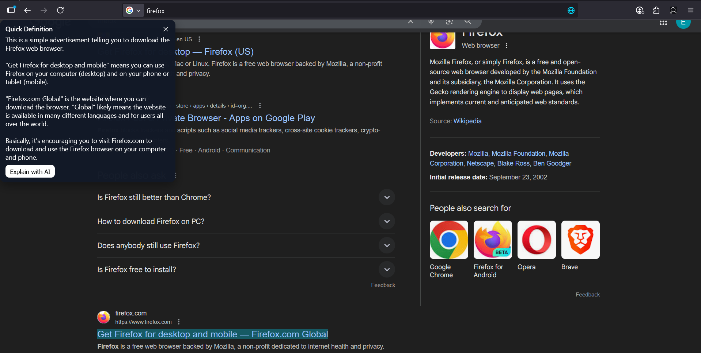
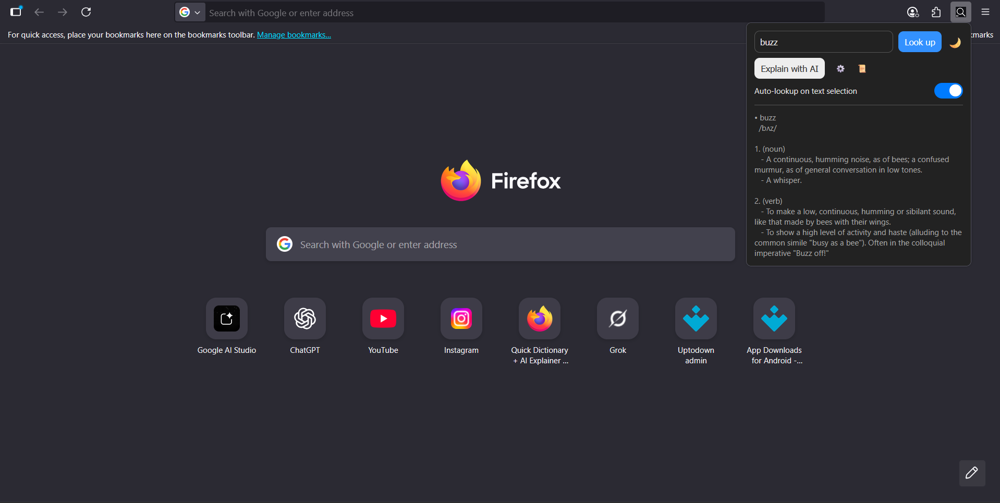
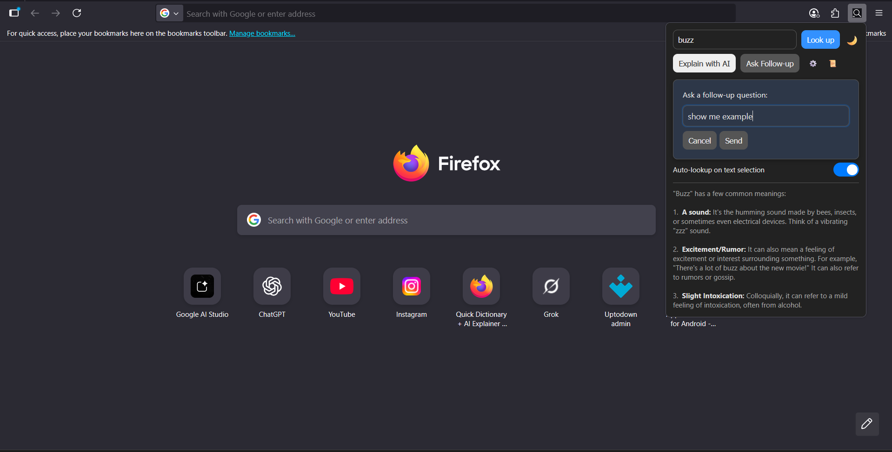

[

](https://addons.mozilla.org/en-US/firefox/addon/quick-dictionary-ai-explainer/)

# Quick Dictionary + AI Explainer (Firefox Add-on)

Highlight text on any webpage to instantly see a dictionary definition, and optionally ask **Gemini** to explain it in simple terms.

## Screenshots

### 1) Highlight text on a webpage (auto tooltip)



### 2) Dictionary lookup in the popup



### 3) AI follow-up question (popup)



---

## What it does

### 1) Instant dictionary tooltip (on-page)

- Select (highlight) text on a webpage.
- If **Auto-lookup** is enabled, a small tooltip appears near your cursor.
- The tooltip calls the **Free Dictionary API** and shows:
  - The word
  - Phonetic text (when available)
  - Up to 3 meanings
  - Up to 2 definitions per meaning (plus examples when available)

### 2) AI “Explain with AI” (Gemini)

You can ask Gemini to explain a word/sentence in beginner-friendly terms.

Supported entry points:

- **Tooltip button**: In the on-page tooltip, click `Explain with AI`.
- **Popup button**: Open the extension popup and click `Explain with AI`.
- **Context menu**: Right-click selected text and choose `Explain with AI`.

AI responses are requested from:

- `https://generativelanguage.googleapis.com/`

The add-on prompts Gemini to:

- Explain simply
- Keep the response under ~120 words

### 3) Follow-up questions (mini chat)

From the popup, after you run an AI explanation:

- A `Ask Follow-up` button appears.
- You can ask a follow-up question that uses your previous conversation as context.

### 4) Chat history

When you start a new AI explanation from the popup, the add-on saves the conversation.

- Stored in `browser.storage.local`.
- Shows a list of past conversations on the Options page.
- You can expand a conversation to view the message history.
- You can clear all stored history.

### 5) Settings (Options page)

The add-on includes an options page where you can configure:

- **Gemini API key** (required for AI explain)
- **Gemini model** (dropdown)
- **Auto-lookup on selection**
- **Dark mode**

---

## Installation (temporary / dev install)

### Firefox

1. Open Firefox.
2. Go to `about:debugging#/runtime/this-firefox`.
3. Click `Load Temporary Add-on...`.
4. Select the `manifest.json` file from this project folder.

---

## How to use

### Dictionary tooltip

- Select a word (or short text) on a webpage.
- The tooltip appears automatically (if enabled).
- Click `✕` to close it.

### Popup lookup

- Click the extension icon.
- Type/paste a word or sentence.
- Click `Look up`.

### AI explain

- Tooltip: select text, then click `Explain with AI`.
- Popup: type/paste text, click `Explain with AI`.
- Context menu: select text, right click, choose `Explain with AI`.

### Follow-up

- After an AI explanation from the popup, click `Ask Follow-up`.
- Type your question and press `Send` (or press Enter).

---

## Required setup: Gemini API key

AI explanations require a Gemini API key.

1. Open the add-on **Options** page.
2. Get an API key from Google AI Studio:
   - https://aistudio.google.com/app/apikey
3. Paste the key into `Gemini API Key` and click `Save Settings`.

---

## Permissions explained

This extension requests:

- `storage`
  - Save settings (API key, model, toggles) in `browser.storage.sync`
  - Save chat history in `browser.storage.local`
- `activeTab`
  - Read selected text from the active tab when opening the popup
- `contextMenus`
  - Add the `Explain with AI` right-click menu item
- `https://api.dictionaryapi.dev/*`
  - Dictionary lookups
- `https://generativelanguage.googleapis.com/*`
  - Gemini AI requests

---

## Privacy notes

- Your **Gemini API key** is stored in `browser.storage.sync` (Firefox Sync storage).
- Chat history is stored locally in `browser.storage.local`.
- The extension sends selected/text input to:
  - Free Dictionary API (for definitions)
  - Google Gemini API (for explanations)

If you don’t want network requests on selection, disable **Auto-lookup**.

---

## Project structure

```
quick-dictionary-ai-explainer/
├── background.js      # context menu + network calls (Dictionary API + Gemini)
├── content.js         # tooltip UI injected into webpages
├── manifest.json      # extension manifest (MV2)
├── popup.html         # popup UI
├── popup.js           # popup behavior + follow-ups
├── options.html       # options/settings + chat history UI
├── options.js         # settings persistence + chat history rendering
├── style.css          # shared styling for popup/options
└── icons/             # extension icons
```

---

## Notes / known gaps (current code)

- `manifest.json` references icon files (`icons/icon16.png`, `icons/icon48.png`, `icons/icon128.png`). Make sure those files exist before publishing.
- The repo folder currently doesn’t include a `LICENSE` file in this workspace (add one before open-sourcing).

---

## Roadmap ideas (optional)

- Add pronunciation audio (if available from dictionary API)
- Support multiple languages
- Pin tooltip / move tooltip to a fixed side panel
- Export chat history

---

## Contributing

PRs welcome. If you change permissions, please explain why in the PR.

---

## Credits

Built by Eyuel Engida.

